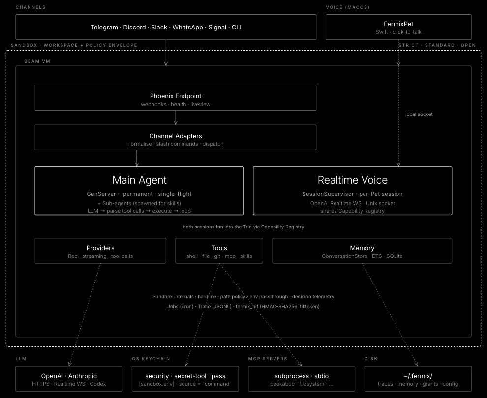

<p align="center">
  &nbsp;&nbsp;
  <picture>
    <source media="(prefers-color-scheme: dark)" srcset="assets/fermix-wordmark-dark.png">
    
  </picture>
</p>

Elixir-native multi-agent AI platform that runs as a local daemon and reaches you through the chat channels you already use.

[](https://github.com/tezra-io/fermix/actions/workflows/ci.yml)


-yellow)


## What is Fermix

Fermix is a personal, self-hosted AI agent: it runs as a background service on your own machine and reaches you through the chat apps you already use. You bring your own model provider key — there is no Fermix cloud, and your config, history, and logs stay under `~/.fermix`.

- **One runtime.** Everything is a single Elixir/OTP application in one BEAM VM — no HTTP bridges, no external worker pool, no message broker. Persistent agents, concurrent conversations, and in-process sub-agents all fall out of that design.
- **Reaches you anywhere.** Telegram, WhatsApp, Slack, Discord, Signal, a first-party iPhone companion, and a local CLI all terminate in the same agent loop.
- **Bring your own model.** Seven providers — OpenAI, OpenAI Codex, Anthropic, SpaceXAI, OpenRouter, Mistral, and a keyless local Ollama — chosen as one primary with an automatic fallback chain. Sub-agents and scheduled jobs can be pinned to their own cheaper model.
- **Always on.** Scheduled jobs run digests, watchers, reminders, and checks — each isolated, bounded, stored durably, and delivered back through your channels. Work survives reboots.
- **Self-contained.** Ships as one self-extracting binary per platform and installs an OS service unit on first run.

Provider auth modes (API key vs. OAuth), channel setup, and scheduling are covered in [Configure](#configure) and [Use](#use) below.

## Quick start

```bash
brew install tezra-io/tap/fermix
fermix setup
```

`fermix setup` installs and starts the background service, then prints the setup URL and opens `http://127.0.0.1:4030/setup` in your browser to finish configuration. On a headless host it runs a terminal wizard instead (`--cli` forces it); `--no-service` configures without installing the service, and `--no-browser` prints the URL instead of opening one.

Confirm the daemon is up:

```bash
$ fermix status
fermix: running (pid 12345, version 0.4.0, up 4s)
```

## Install

### Homebrew (macOS, Linux)

```bash
brew install tezra-io/tap/fermix
```

> **Installing plugins requires [`cosign`](https://github.com/sigstore/cosign).** Fermix verifies each plugin's signature before activating it and refuses unsigned or tampered artifacts, so the daemon needs `cosign` on its `PATH`. Install it with `brew install cosign` (macOS/Linux).

> **After `brew upgrade fermix`, run `fermix restart`.** The upgrade swaps the binary on disk, but the background daemon keeps running the old version until it is restarted. `fermix status` and `fermix doctor` warn while the running daemon's version differs from the installed binary.

### Build from source

Requires Elixir ≥ 1.17, Erlang/OTP 28, and [Zig](https://ziglang.org) 0.15.2 — Burrito uses it to package the self-contained binary.

```bash
git clone https://github.com/tezra-io/fermix.git
cd fermix
mix deps.get
# Compile + digest the web assets, then package a self-contained binary into
# burrito_out/. Targets: macos_aarch64, macos_x86_64, linux_aarch64,
# linux_x86_64 — omit BURRITO_TARGET to build all four.
MIX_ENV=prod mix assets.deploy
BURRITO_TARGET=macos_aarch64 MIX_ENV=prod mix release fermix --overwrite
sudo install -m 0755 burrito_out/fermix_macos_aarch64 /usr/local/bin/fermix
fermix setup
```

To run against unreleased code without packaging a binary, use [`mix fermix.dev`](#develop) instead.

## Configure

`fermix setup` is the single entry point for first-run configuration. By default it installs the service and opens the browser setup at `http://127.0.0.1:4030/setup`; on a headless host — or with `--cli` — it runs a terminal wizard. It also accepts non-interactive flags (`--openai-api-key`, `--telegram-bot-token`, …) for scripted installs. Once setup is complete, no-arg reruns stay idempotent and only seed missing prompt files; use `fermix setup --reconfigure` to force the provider/model/effort prompts again. It writes a typed snapshot to:

- `FERMIX_HOME/config.toml` (default `FERMIX_HOME` is `~/.fermix`)

It also creates the workspace roots the runtime expects:

- `$FERMIX_HOME/skills`
- `$FERMIX_HOME/journals`
- `$FERMIX_HOME/realtime`
- `$FERMIX_HOME/traces`
- `$FERMIX_HOME/logs`
- `$FERMIX_HOME/auth.json` (when `openai_codex` is selected; `0600`)

Regular OpenAI uses `OPENAI_API_KEY`. Codex uses the separate `openai_codex` provider and imports OAuth tokens from the Codex CLI into the provider-scoped token store at `~/.fermix/auth.json`, refreshed by the supervised `TokenManager`. Realtime voice V1 uses the regular OpenAI API key even when the text/chat provider is `openai_codex`.

Runtime precedence is:

1. compile-time defaults in `config/config.exs`
2. persisted setup state from `config.toml`
3. environment variable overrides applied in `config/runtime.exs`

To let the agent work in a project directory beyond its workspace and launch/request cwd, grant it with `fermix grant path PATH` from the CLI (or `/grant path PATH` on a channel); the agent can also ask for a directory in chat, which you approve with `/confirm`.

### Scheduled job delivery

Scheduled jobs can deliver their final response to an explicit per-job target, or to a cron-specific default channel target stored in `config.toml`:

```toml
[fermix_core.jobs]
default_delivery_mode = "channel"

[fermix_core.jobs.default_delivery_target]
platform = "telegram"
chat_id = "8217352118"
```

`chat_id` is the external channel conversation id, such as a Telegram chat id; it is not a Fermix session id. Delivery settings are resolved into each job when the job is created, so changing the default later does not silently retarget existing jobs. Jobs can also set an optional `expires_at` ISO8601 timestamp; when it is reached, Fermix marks the job expired through scheduler state.

### Transcription

Inbound voice notes are transcribed before they reach the agent, through a pluggable speech-to-text backend:

```toml
[fermix_core.transcription]
backend = "openai"
model = "gpt-4o-mini-transcribe"
max_file_mb = 20
```

`backend` is `openai`, `xai`, or `deepgram`. `model` defaults to `gpt-4o-mini-transcribe`; Deepgram uses `nova-3`, and SpaceXAI's native STT is modelless, so it takes no model. Each backend reads its own optional key slot — `openai_api_key`, `xai_api_key`, `deepgram_api_key` — and OpenAI and SpaceXAI fall through to the matching chat-provider key when the slot is unset. Deepgram always requires its own key, and SpaceXAI STT requires an API key even when the `xai` chat provider is on OAuth. `max_file_mb` (default 20) bounds the audio Fermix will accept.

Set it from the web setup **Transcription** card, or with `fermix setup --transcription-backend/--transcription-model/--transcription-api-key`. `fermix doctor` reports a `transcription` row.

### Environment variables

> **The credential variables are optional.** Running `fermix setup` (CLI wizard or web setup) collects your provider API keys and channel tokens and stores the secrets in your OS keychain, so a configured install needs **none** of the API-key/token variables below. Set them only for headless or container deployments that inject secrets through the environment — the **Required** column assumes that env-only style of configuration. (The `FERMIX_*` runtime/Realtime rows are environment-only operational knobs, unrelated to secret storage.)

| Variable | Required | Description |
|----------|----------|-------------|
| `OPENAI_API_KEY` | Yes when provider is `openai` | OpenAI API key |
| `ANTHROPIC_API_KEY` | Yes when provider is `anthropic` on api-key auth | Anthropic API key |
| `XAI_API_KEY` | Yes when provider is `xai` on api-key auth | SpaceXAI API key |
| `OPENROUTER_API_KEY` | Yes when provider is `openrouter` | OpenRouter API key |
| `MISTRAL_API_KEY` | Yes when provider is `mistral` | Mistral API key |
| `FERMIX_ANTHROPIC_AUTH_MODE` | No | Override the Anthropic auth mode |
| `FERMIX_XAI_AUTH_MODE` | No | Override the SpaceXAI auth mode |
| `XAI_BASE_URL` | No | Override the SpaceXAI base URL |
| `OLLAMA_BASE_URL` | No | Override the local Ollama base URL |
| `WHATSAPP_ACCESS_TOKEN` | If WhatsApp is enabled | WhatsApp Cloud API access token |
| `WHATSAPP_PHONE_NUMBER_ID` | If WhatsApp is enabled | WhatsApp phone number ID |
| `WHATSAPP_VERIFY_TOKEN` | If WhatsApp is enabled | WhatsApp webhook verification token |
| `WHATSAPP_APP_SECRET` | If WhatsApp is enabled | WhatsApp webhook HMAC secret |
| `DISCORD_BOT_TOKEN` | If Discord is enabled | Discord bot token |
| `DISCORD_BOT_USER_ID` | If Discord is enabled | Discord bot user ID |
| `SLACK_BOT_TOKEN` | If Slack is enabled | Slack bot token |
| `SLACK_SIGNING_SECRET` | If Slack is enabled | Slack request signing secret |
| `SIGNAL_ACCOUNT` | If Signal is enabled | Signal phone/account identifier |
| `SIGNAL_CLI_PATH` | No | Override the `signal-cli` executable path |
| `FERMIX_APNS_KEY` | If mobile push is enabled | APNs `.p8` signing key for direct push to the iPhone companion; resolved from the keychain first |
| `FERMIX_HOME` | No | Override the persisted config and workspace root |
| `FERMIX_TRACE_DIR` | No | Override the trace output directory |
| `FERMIX_LOG_FILE` | No | Override the log file path |
| `FERMIX_HTTP_BIND` | No | Web endpoint bind address; defaults to `127.0.0.1` (loopback). `0.0.0.0` serves on the network but also exposes the setup/reconfig surface — gate it behind a trusted network |
| `FERMIX_REALTIME_ENABLED` | No | Enable the local Realtime voice companion mode |
| `FERMIX_REALTIME_PROVIDER` | No | Realtime provider; only `openai` is supported |
| `FERMIX_REALTIME_MODEL` | No | Override the OpenAI Realtime model |
| `FERMIX_REALTIME_VOICE` | No | Override the Realtime voice |
| `FERMIX_REALTIME_MAX_SESSION_MINUTES` | No | Per-session voice duration cap |
| `FERMIX_REALTIME_MAX_COST_CENTS` | No | Per-session estimated/reported cost cap |
| `FERMIX_REALTIME_MAX_ESTIMATED_COST_CENTS_PER_SESSION` | No | Long-form alias for `FERMIX_REALTIME_MAX_COST_CENTS` |
| `FERMIX_REALTIME_PERSIST_TRANSCRIPTS` | No | Persist final voice transcripts as local memory text |

In dev/test these default to empty strings.

For providers, only credentials — API keys, auth modes, and base URLs — are read from the environment. Provider selection, model, and reasoning effort are config-only and never overlaid from an environment variable.

## Use

### Daemon control

`fermix service install` writes the OS service unit (launchd `.plist` on macOS, systemd `.service` on Linux) and enables it. Subsequent control is uniform across platforms:

```bash
fermix service install [--user|--system]   # write and enable the unit
fermix start                               # start the installed service
fermix status                              # ask the daemon over its control socket
fermix ask "say pong"                      # send one local prompt to MainAgent
fermix logs -f                             # tail ~/.fermix/logs/fermix.log
fermix stop
fermix restart
fermix service uninstall
```

The unit calls `fermix run`, which boots the OTP supervision tree, binds the Phoenix endpoint, and blocks. Logs rotate at `~/.fermix/logs/fermix.log` (10 MB × 10 files by default).

`--user` scope is per-user and requires no sudo; on Linux it enables `loginctl enable-linger` so the service survives logout. `--system` scope binds at boot and requires sudo.

### Local voice companion

Realtime voice is an optional local mode: **FermixPet**, a native macOS app (macOS 13+) that lets you talk to the agent by voice. The daemon owns provider auth, prompts, tools, memory, and cost caps; the app only captures and plays audio, over a `0600` Unix socket at `~/.fermix/realtime.sock`.

Enable it on the **setup page** under the *Realtime* tab (it needs an OpenAI API key), then restart the daemon. Check it with `fermix voice status`.

Realtime uses the same capability surface as the main agent, so voice tool scope is governed by the sandbox mode and command profile rather than a voice-specific knob.

FermixPet lives in its own repo, [tezra-io/fermix-macos](https://github.com/tezra-io/fermix-macos), which ships it as a Developer ID-signed, notarized DMG (universal2) with a Homebrew cask. Grab the DMG from that repo's releases, or build from its source:

```bash
git clone https://github.com/tezra-io/fermix-macos
cd fermix-macos/Apps/FermixPet
./script/build_and_run.sh install
open "$HOME/Applications/FermixPet.app"
```

Full setup options, the dev workflow, and troubleshooting are in the [fermix-macos repo](https://github.com/tezra-io/fermix-macos).

### Channels

All channels normalize inbound messages and dispatch them through the same `FermixCore.Agents.MainAgent`.

- **Telegram** — long-poll ingress, Bot API replies. Voice notes, audio files, audio-MIME documents, and round video notes are transcribed before reaching the agent.
- **WhatsApp** — Cloud API webhook ingress, text replies. Voice notes are transcribed before reaching the agent.
- **Slack** — Events API DM and `app_mention` ingress, Web API replies.
- **Discord** — Gateway DM and app-mention ingress, REST replies.
- **Signal** — `signal-cli` receive loop, subprocess send path.
- **Mobile (iOS)** — dedicated Noise-encrypted listener on `:4031` for the iPhone companion app, advertised over Bonjour and reachable on a tailnet. One socket per paired device carries streaming replies, tool activity, chunked media, slash commands, and cursor-exact history sync; devices are paired with `fermix pair` and revoked with `fermix devices revoke`. Disabled by default.
- **CLI** — local stdin/stdout smoke path through the same dispatcher and `MainAgent`.

### HTTP endpoints

| Method | Path | Purpose |
|--------|------|---------|
| `GET` | `/health/live` | Process liveness only |
| `GET` | `/health/ready` | Structured readiness and runtime health |
| `GET` | `/health` | Backward-compatible alias of `/health/ready` |
| `GET` | `/setup` | Shared setup/readiness LiveView |
| `GET` | `/webhook/whatsapp` | WhatsApp verification challenge |
| `POST` | `/webhook/whatsapp` | WhatsApp webhook ingress |
| `POST` | `/webhook/slack` | Slack Events API ingress |

Telegram, Discord, and Signal use long-poll or persistent client transports and do not mount HTTP routes. The mobile channel runs its own listener on `:4031` — separate from the web endpoint above — exposing only a WebSocket upgrade at `/ws` and an unauthenticated `GET /healthz` liveness probe, so putting the phone surface on the network never exposes `/setup`.

## CLI reference

| Command | Description |
|---------|-------------|
| `fermix setup [--reconfigure]` | Install + start the service and open the browser setup (or a terminal wizard with `--cli`) |
| `fermix auth login [--provider PROVIDER]` | Complete or refresh a provider OAuth login |
| `fermix run` | Start the daemon in the foreground (used by service units) |
| `fermix service install [--user\|--system]` | Write and enable the OS service unit |
| `fermix service uninstall [--user\|--system]` | Remove the OS service unit |
| `fermix start [--user\|--system]` | Start the installed OS service |
| `fermix stop [--user\|--system]` | Stop the installed OS service |
| `fermix restart [--user\|--system]` | Restart the installed OS service |
| `fermix status` | Print running daemon status via the control socket (exit `3` if not running) |
| `fermix health` | Print structured daemon readiness and runtime health |
| `fermix voice status [--json]` | Show local Realtime voice companion status |
| `fermix pair` | Pair an iPhone companion device — renders a QR, then approves only if the six-digit code matches the one on the phone |
| `fermix devices list\|revoke ID` | List paired mobile devices, or revoke one and drop its live socket |
| `fermix ask` / `fermix chat` | Send one local prompt to the running daemon and print the MainAgent reply |
| `fermix sandbox explain` | Show the effective sandbox roots, each annotated `(granted)` or `(mode)` |
| `fermix grant path PATH` | Persist a sandbox root the agent may work in |
| `fermix revoke path PATH` | Remove a persisted sandbox root |
| `fermix agents` | Print main-agent and skill-worker status |
| `fermix capabilities` | Print registered runtime capabilities |
| `fermix skills` | List, view, and reload installed skills |
| `fermix plugins` | Manage local Fermix plugins |
| `fermix memory` | Review and restore durable memory rows |
| `fermix logs [-f] [-n LINES]` | Show or follow the daemon log file |
| `fermix upgrade [--check]` | Self-update from signed releases (cosign-verified, atomic swap) |
| `fermix doctor [--full]` | Post-install diagnostics; `--full` adds network checks |
| `fermix version` | Print the release version |
| `fermix help` | Show usage |

`fermix upgrade` detects package-manager installs (Homebrew, dpkg) and refuses to mutate them — it prints the right `brew upgrade` / `apt upgrade` command and exits non-zero. Unmanaged installs follow `fetch → cosign verify → snapshot → rename → restart → health-check`, with rollback from `~/.fermix/.previous` if the post-swap health check fails. A package-manager upgrade only swaps the binary on disk — the daemon keeps running the old version until you run `fermix restart` (`fermix status` and `fermix doctor` warn while the versions differ). If the service unit drifted across the upgrade (e.g. an updated `PATH` or template), re-run `fermix setup` instead: it rewrites and reloads the unit — which a plain restart never does — without a manual `fermix service install`.

## Channel command reference

Plain-text commands work in every channel through the shared dispatcher, and locally through `fermix ask` / `fermix chat`.

| Command | Description |
|---------|-------------|
| `/compact` | Summarize the current conversation window now and keep the summary in history |
| `/new` | Clear the current conversation history only |
| `/clear` | Alias for `/new` |
| `/help` | List available commands |
| `/whoami` | Show the stable channel user id used for command authorization |
| `/background` | Run the current request as a durable background job (`/tasks` to check, `/stop` to cancel); alias `/bg` |
| `/tasks` | List in-flight background tasks for this channel |
| `/stop` | Cancel a running background task |
| `/ultra` | Run the next turn in exhaustive multi-agent (ultra) mode |
| `/sandbox` | Inspect and adjust the workspace sandbox (env allow/deny/set, command presets, path grants); aliased as `/grant path PATH`, `/revoke path PATH`, and `/confirm TOKEN` |
| `/soul` | Review, apply, revert, or reset the agent's persona (`SOUL.md`); owner-only, and mutations are confirmed with a token |

Outside the local CLI, mutating commands require a per-channel owner. For a
single-user channel, `owner_user_id` is enough; it also becomes the default
ingress allowlist unless you explicitly set `allowed_user_ids` or
`allowed_sender_ids`:

```toml
[fermix_channels.telegram]
owner_user_id = "123456789"
command_allowlist = ["987654321"]
```

If `owner_user_id` is absent, Fermix can derive the command owner from a single
configured ingress allowlist entry. Multiple allowed users still require an
explicit `owner_user_id` or `command_allowlist`. Use `/whoami` from the target
account to discover the id, then persist it with `fermix setup --reconfigure` or
by editing `~/.fermix/config.toml`.

Automatic conversation compaction is controlled by:

```toml
[fermix_core.compaction]
enabled = true
threshold = 0.85
```

After each agent turn, Fermix estimates the conversation tokens for that conversation key. When usage reaches `threshold * model_context_window`, it summarizes older messages and replaces the stored conversation history with the summary plus recent turns. `/new` only clears the conversation window; long-term memory, resource revisions, and scheduled jobs are preserved.

## Architecture



```
fermix/ (umbrella)
├── apps/fermix_core/       # Agents, providers, tools, memory, setup, CLI, auth, tracing
├── apps/fermix_channels/   # Telegram, WhatsApp, Slack, Discord, Signal, CLI
├── apps/fermix_web/        # Phoenix: setup LiveView, health, webhook ingress
└── apps/fermix_nif/        # C NIF (elixir_make): kill_pgid process-group signal shim
```

The native macOS voice companion (FermixPet) lives in [tezra-io/fermix-macos](https://github.com/tezra-io/fermix-macos) and talks to the daemon over the local Realtime socket.

One BEAM VM, all `:permanent` under OTP. The data flow is straight-line:

```
channel adapter → FermixChannels.Dispatcher → FermixCore.Agents.MainAgent
  → capability execution → provider → LLM → reply
```

The agent loop calls the provider, parses tool calls, executes them through the registered `FermixCore.Capabilities.Registry`, and recurses up to a bounded per-loop iteration cap (default 100 for interactive turns, sub-agents, and scheduled jobs; tunable via `[fermix_core.iteration_limits]`). Built-in tools are capabilities, and installed skills are registered as capabilities as well.

Built-in tools ship inside Fermix. They are always available when registered; users do not install or remove them. Skills are different: they live under the Fermix skills directories (`priv/skills`, `~/.fermix/skills`, and plugin roots), and each skill carries its own instructions and allowed-tool boundary.

The current built-in capability set is:

| Tool | Description |
|------|-------------|
| `shell` | Execute system commands with timeout |
| `file_read` | Read files with offset/limit |
| `file_write` | Write files with auto mkdir |
| `file_edit` | Replace one unique string anchor in a file |
| `glob_search` | Find files with bounded glob matching |
| `content_search` | Search file contents without shelling out |
| `git_read` | Inspect git status, logs, branches, diffs, and objects |
| `git_write` | Stage, commit, checkout, or pull changes; push is deferred to M10 approval |
| `web_fetch` | Fetch a public URL and return markdown-light text |
| `web_search` | Search the public web through the configured backend (Brave, Exa, Firecrawl, Parallel, Perplexity, Tavily, or the keyless DuckDuckGo default); a configured backend that is unavailable degrades once to DuckDuckGo |
| `place_search` | Find businesses, landmarks, and addresses with hours, ratings, contact details, and a source link per result; advertised only when a Brave Search API key is configured (the same key as the Brave `web_search` backend, metered separately per call) |
| `subagents` | Run one or more temporary subagents for delegated work, concurrently up to a cap |
| `skill_create` | Scaffold a local skill with starter eval cases |
| `skill_list` | List installed skills available to run via `skill_run` |
| `skill_run` | Run an installed skill by name |
| `skill_view` | Show an installed skill's instructions and metadata |
| `skill_reload` | Re-scan the skills directories |
| `model_routing_config` | Read or update local model-routing config |
| `tool_help` | Return full docs for one registered capability |
| `memory_store` | Store key-value facts |
| `memory_recall` | Recall stored facts |
| `memory_sources_list` | List visible memory sources, including scheduled-job sources |
| `browser` | Drive a browser via the `agent-browser` CLI (snapshot, navigate, click, fill, screenshot) |
| `schedule_job` | Create a durable scheduled job and memory source, with optional expiry |
| `list_jobs` | List scheduled jobs |
| `update_job` | Update a scheduled job's schedule, prompt, or config |
| `pause_job` | Pause a scheduled job |
| `resume_job` | Resume a paused scheduled job |
| `remove_job` | Remove a scheduled job |
| `run_job_now` | Trigger a scheduled job immediately |
| `list_job_runs` | List a scheduled job's run history |
| `get_job_run` | Show one scheduled-job run in detail |
| `send_attachment` | Send a file attachment back through the active channel |
| `react` | Acknowledge a message with a channel emoji reaction instead of a text reply |
| `generate_image` | Generate an image through the configured media backend |
| `request_directory_access` | Ask the owner to grant a directory, approved with `/confirm` |

`computer_use` is seeded only when Computer Use is enabled and its sidecar and OS permissions are ready.

Observability:

- Structured JSONL traces under `FERMIX_HOME/traces/YYYY-MM-DD/<type>.jsonl`
- Rotating log file at `FERMIX_HOME/logs/fermix.log`
- Telemetry events for provider calls, tool execution, channel ingress, and agent lifecycle
- `/health/ready` reports config paths, provider status, per-channel status, memory backend status, and Realtime voice status

## Develop

Requirements: Elixir ≥ 1.17, Erlang/OTP ≥ 28, Git, and `signal-cli` on `PATH` (or `SIGNAL_CLI_PATH` configured) if Signal is enabled.

```bash
git clone git@github.com:tezra-io/fermix.git
cd fermix
mix setup           # deps.get + install git hooks
mix quality         # format check → compile --warnings-as-errors → credo --strict → dialyzer → test
mix test            # tests only
mix test --only integration
```

`mix quality` is the canonical "does everything pass" command. The git pre-commit hook enforces format, compile, credo, and tests.

### Running the daemon in dev

`mix fermix.dev` is the single entry point — it boots core, channels, and web in one BEAM node with the daemon control socket and Realtime voice socket enabled, so `fermix ask`, `fermix status`, the macOS companion, and the channel pollers all attach to one process. Use `iex -S mix fermix.dev` when you want an attached shell.

```bash
# Full stack — Phoenix on :4030, daemon socket, Realtime, all enabled channels
FERMIX_HOME=~/.fermix-dev \
OPENAI_API_KEY=sk-... \
FERMIX_REALTIME_ENABLED=true \
mix fermix.dev

# Skip a layer when iterating on one subsystem
mix fermix.dev --no-channels       # no Telegram/WhatsApp/Slack/Discord/Signal
mix fermix.dev --no-realtime       # no voice socket
mix fermix.dev --no-web            # no Phoenix endpoint
```

The readiness banner prints what actually started:

```
Fermix dev daemon online
  Daemon socket:    /Users/you/.fermix-dev/daemon.sock
  Phoenix endpoint: http://127.0.0.1:4030
  Realtime socket:  /Users/you/.fermix-dev/realtime.sock
  Channels:         telegram
```

If a channel or Realtime is not configured, the banner shows the reason instead of crashing — the daemon still comes up so the rest of the stack is testable.

Two Fermix instances polling the **same** Telegram bot token race on `getUpdates`, and Telegram returns `409 Conflict` ("terminated by other getUpdates request"). The bot token is read **only** from each `FERMIX_HOME`'s `config.toml` (set via `fermix setup`), never from the environment — so give your dev (`~/.fermix-dev`) and prod (`~/.fermix`) instances **distinct** bot tokens. If you store secrets in the OS keychain, also set a distinct `[fermix_core] profile` (e.g. `profile = "dev"`) in the non-default install so its keychain entries are namespaced (`fermix:dev:TELEGRAM_BOT_TOKEN`) instead of overwriting the default `general` entries (`fermix:TELEGRAM_BOT_TOKEN`). Set the profile **before** running `fermix setup`; there is no migration when it changes, so flipping it on a populated install orphans the old keychain entries (re-run `fermix setup` to re-write them). (The dev `mix fermix.dev` port-`4030` preflight only guards the Phoenix port, not the poller, so it is not a substitute for separate tokens.)

### Smoke-testing against the running daemon

With `mix fermix.dev` running, exercise the agent path locally over the daemon socket:

```bash
fermix status                                                  # ping the daemon
fermix ask "say pong"                                          # one-shot prompt
fermix ask --session scenario-web-fetch "validate web_fetch localhost rejection"
echo "summarize current health" | fermix ask --stdin --json    # stdin + JSON output
curl -s http://127.0.0.1:4030/health/ready | jq .              # Phoenix readiness
```

For the macOS Realtime companion (from [tezra-io/fermix-macos](https://github.com/tezra-io/fermix-macos)), point it at the same `FERMIX_HOME`:

```bash
cd fermix-macos/Apps/FermixPet
FERMIX_HOME=~/.fermix-dev ./script/build_and_run.sh
```

### Unit and integration tests

`mix test` and `mix test --only integration` do **not** need a running `mix fermix.dev` — each test boots its own minimal supervision tree and uses a tmp-dir-scoped Memory database independent of `FERMIX_HOME`. Run `mix quality` before pushing; the pre-commit hook enforces the same gates.

### Latency benchmarks

The deterministic benchmark harness uses a mock provider and `Req.Test` channel stubs, so it does not call real LLMs or external channel networks. The default run covers the shared dispatcher → `MainAgent` → `AgentLoop` path; adapter, E2E, idempotency, and soak scenarios are available explicitly by name.

```bash
FERMIX_HOME=~/.fermix-dev mix fermix.bench --list
FERMIX_HOME=~/.fermix-dev mix fermix.bench --output=bench/current.json
FERMIX_HOME=~/.fermix-dev mix fermix.bench --scenarios=shared_text_minimal --samples=1000 --warmup=20 --output=bench/current.json
FERMIX_HOME=~/.fermix-dev mix fermix.bench --scenarios=telegram_send_short_text,telegram_e2e_text --samples=200 --warmup=10 --output=bench/adapter.json
FERMIX_HOME=~/.fermix-dev mix fermix.bench.soak --output=bench/soak.json
mix fermix.bench.diff bench/baseline.json bench/current.json
```

Relative benchmark paths are resolved from the umbrella root, so the commands above write to the repo-level `bench/` directory even when invoked from a child directory. Use `--compare=bench/baseline.json` with `mix fermix.bench` when you want the run to print the p95 delta table after writing `bench/current.json`.

## Resource history CLI

Versioned prompt and memory resources can be inspected from Mix:

```bash
mix fermix.resource.list
mix fermix.resource.history user_md --limit 10
mix fermix.resource.show user_md 3
mix fermix.resource.diff user_md 2 3
mix fermix.resource.rollback user_md 2
```

Use `--scope <conversation-key>` for checkpoint resources. Checkpoint rollback is not supported; checkpoint revisions are audit/history records only. Rolling back `USER.md` or `MEMORY.md` restores the file-backed prompt resource, but future memory rebuilds can overwrite the file if the underlying promoted memories are unchanged.

## Documentation

- [`ARCHITECTURE.md`](ARCHITECTURE.md) — supervision tree, agent loop, providers, channels, and observability
- [`CHANGELOG.md`](CHANGELOG.md) — release history (Keep a Changelog format, semver)
- [`CONTRIBUTING.md`](CONTRIBUTING.md) — development workflow, quality gates, and PR process
- [`SECURITY.md`](SECURITY.md) — supported versions and vulnerability reporting

## License

Released under the [MIT License](LICENSE).
