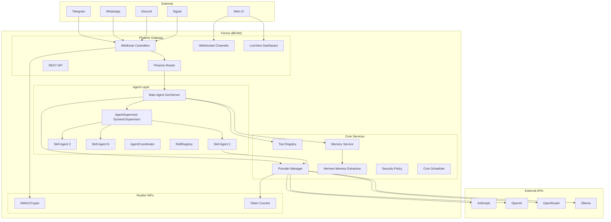

# Fermix — Project Plan

**Elixir-native multi-agent AI platform**

**Status**: Planning  
**Author**: Sujeeth / Aira  
**Date**: 2026-03-30  
**Predecessor**: RustyClaw (github.com/tezra-io/rustyclaw)

---

## 1. Project Overview

Fermix is a ground-up Elixir/Phoenix multi-agent AI platform. It replaces RustyClaw's split architecture (Rust gateway + Elixir orchestrator connected by HTTP bridge) with a unified BEAM-native system.

**Why:**
- Eliminate the HTTP bridge tax between Rust and Elixir
- One runtime, one deployment, one supervision tree
- OTP supervision from gateway to agent (crash recovery everywhere)
- Hot code reloading for agent logic
- Phoenix Channels/LiveView for real-time dashboard
- BEAM's lightweight processes are ideal for multi-agent coordination

**What Fermix is:**
- Phoenix gateway handling webhooks, API, WebSocket
- GenServer-based agents with OTP supervision
- Ephemeral skill agents spawned on demand
- Hub-and-spoke: persistent Main Agent + ephemeral skill workers
- Rustler NIFs only where Rust genuinely outperforms (crypto, tokenization)

**What Fermix is NOT:**
- A fork of RustyClaw (clean repo, selective port)
- A Rust project with Elixir bolted on
- A monolith (umbrella app with clear boundaries)

---

## 2. Architecture



---

## 3. Port vs Rewrite Matrix

### Port from RustyClaw Elixir layer (direct)

| Component | Source | Effort | Notes |
|-----------|--------|--------|-------|
| AgentServer | `elixir/.../agent_server.ex` | Low | Port + fix run_task (TEZ-146) |
| AgentSupervisor | `elixir/.../agent_supervisor.ex` | Low | Direct port |
| AgentDefinition | `elixir/.../agent_definition.ex` | Low | Add `role` field |
| AgentCoordinator | `elixir/.../agent_coordinator.ex` | Low | Capability matching + ACL |
| BtwRouter | `elixir/.../btw_router.ex` | Low | Side-channel routing |
| BtwServer | `elixir/.../btw_server.ex` | Medium | Remove RustBridge dependency, call providers directly |
| ResourceLock | `elixir/.../resource_lock.ex` | Low | Direct port |
| LoopDetectionHook | `elixir/.../loop_detection_hook.ex` | Low | Direct port |
| Hermes extraction | `elixir/.../hermes/` | Medium | Port all 5 phases |
| MessageProvenance | `elixir/.../message_provenance.ex` | Low | Direct port |
| TraceStore | `elixir/.../trace_store.ex` | Low | Direct port |
| ToolSynthesis | `elixir/.../tool_synthesis/` | Medium | Port API router + registry |

### Rewrite in Elixir (from Rust reference)

| Component | Rust Source | Effort | Notes |
|-----------|------------|--------|-------|
| Telegram channel | `src/channels/telegram.rs` (~800 lines) | Medium | Req + webhook parsing |
| WhatsApp channel | `src/channels/whatsapp.rs` (~600 lines) | Medium | Graph API, signature verification |
| Discord channel | `src/channels/discord.rs` (~500 lines) | Medium | Gateway WebSocket + REST |
| Signal channel | `src/channels/signal.rs` | Medium | signal-cli integration |
| LLM Providers | `src/providers/*.rs` | High | Anthropic, OpenAI, OpenRouter, Ollama — streaming SSE |
| Agent loop | `src/agent/loop_.rs` (~4000 lines) | High | Tool-call parsing, conversation management, compaction |
| Tool system | `src/tools/*.rs` (37+ tools) | High | Shell, file, git, browser, delegate, memory, etc. |
| Memory backends | `src/memory/*.rs` | Medium | SQLite + embedding search |
| Security policy | `src/security/*.rs` | Medium | Tool ACLs, approval system |
| Sentinel filtering | `src/security/sentinel/` | Medium | Content filtering, redaction |
| Config system | `src/config/schema.rs` (~2500 lines) | Medium | TOML config parsing |
| Webhook verification | `src/channels/mod.rs` | Low | HMAC-SHA256 — NIF candidate |

### Build fresh

| Component | Effort | Notes |
|-----------|--------|-------|
| Phoenix gateway | Medium | Router, controllers, plugs |
| LiveView dashboard | Medium | Agent status, logs, memory viewer |
| Phoenix Channels (WebSocket) | Low | Real-time agent chat |
| Cron scheduler | Low | Replace CronBridge with native GenServer |
| Skill templates + registry | Low | Filesystem-based YAML+MD loader |
| Journal system | Low | Markdown file writer |
| CLI (`fermix` command) | Medium | Mix tasks or escript |

---

## 4. Repo Structure

Elixir umbrella app:

```
fermix/
├── README.md
├── mix.exs                          # Umbrella root
├── config/
│   ├── config.exs
│   ├── dev.exs
│   ├── prod.exs
│   └── runtime.exs                  # Runtime config (env vars, secrets)
│
├── apps/
│   ├── fermix_core/                 # Core domain logic
│   │   ├── mix.exs
│   │   └── lib/
│   │       ├── fermix_core/
│   │       │   ├── agents/
│   │       │   │   ├── agent_server.ex        # Ported from RustyClaw
│   │       │   │   ├── agent_supervisor.ex    # Ported
│   │       │   │   ├── agent_definition.ex    # Ported + role field
│   │       │   │   ├── agent_coordinator.ex   # Ported
│   │       │   │   ├── main_agent.ex          # New: Main Agent lifecycle
│   │       │   │   └── skill_registry.ex      # New: Template loader
│   │       │   ├── providers/
│   │       │   │   ├── provider.ex            # Behaviour
│   │       │   │   ├── anthropic.ex
│   │       │   │   ├── openai.ex
│   │       │   │   ├── openrouter.ex
│   │       │   │   ├── ollama.ex
│   │       │   │   └── streaming.ex           # SSE parser
│   │       │   ├── tools/
│   │       │   │   ├── tool.ex                # Behaviour
│   │       │   │   ├── shell.ex
│   │       │   │   ├── file_read.ex
│   │       │   │   ├── file_write.ex
│   │       │   │   ├── file_edit.ex
│   │       │   │   ├── git.ex
│   │       │   │   ├── memory_tool.ex
│   │       │   │   ├── invoke_skill.ex
│   │       │   │   ├── browser.ex
│   │       │   │   └── web_fetch.ex
│   │       │   ├── memory/
│   │       │   │   ├── memory.ex              # Behaviour
│   │       │   │   ├── sqlite_backend.ex
│   │       │   │   ├── embedding_backend.ex
│   │       │   │   └── conversation_store.ex  # Per-chat history
│   │       │   ├── hermes/
│   │       │   │   ├── extractor.ex           # Ported
│   │       │   │   ├── consolidator.ex        # Ported
│   │       │   │   ├── confidence.ex          # Ported
│   │       │   │   ├── decay.ex               # Ported
│   │       │   │   └── gist_generator.ex      # New: Tier 1 gist
│   │       │   ├── security/
│   │       │   │   ├── security_policy.ex
│   │       │   │   ├── approval_manager.ex
│   │       │   │   └── sentinel.ex
│   │       │   ├── agent_loop.ex              # Core LLM conversation loop
│   │       │   └── config.ex                  # Config schema
│   │       └── fermix_core.ex
│   │
│   ├── fermix_channels/             # Channel integrations
│   │   ├── mix.exs
│   │   └── lib/
│   │       ├── fermix_channels/
│   │       │   ├── channel.ex                 # Behaviour
│   │       │   ├── telegram.ex
│   │       │   ├── whatsapp.ex
│   │       │   ├── discord.ex
│   │       │   ├── signal.ex
│   │       │   ├── slack.ex
│   │       │   ├── irc.ex
│   │       │   └── webhook_verifier.ex        # Uses Rustler NIF
│   │       └── fermix_channels.ex
│   │
│   ├── fermix_web/                  # Phoenix web layer
│   │   ├── mix.exs
│   │   └── lib/
│   │       ├── fermix_web/
│   │       │   ├── router.ex
│   │       │   ├── endpoint.ex
│   │       │   ├── controllers/
│   │       │   │   ├── webhook_controller.ex  # Telegram, WhatsApp, etc.
│   │       │   │   ├── api_controller.ex      # REST API
│   │       │   │   └── health_controller.ex
│   │       │   ├── channels/
│   │       │   │   └── agent_channel.ex       # WebSocket chat
│   │       │   ├── live/
│   │       │   │   ├── dashboard_live.ex
│   │       │   │   ├── agents_live.ex
│   │       │   │   ├── memory_live.ex
│   │       │   │   └── logs_live.ex
│   │       │   └── plugs/
│   │       │       ├── auth.ex
│   │       │       └── rate_limit.ex
│   │       └── fermix_web.ex
│   │
│   └── fermix_nif/                  # Rustler NIFs
│       ├── mix.exs
│       ├── native/fermix_nif/       # Rust crate
│       │   ├── Cargo.toml
│       │   └── src/
│       │       ├── lib.rs
│       │       ├── hmac.rs          # HMAC-SHA256 verification
│       │       └── tokenizer.rs     # tiktoken token counting
│       └── lib/
│           └── fermix_nif.ex        # NIF module
│
├── docs/
│   ├── PROJECT_PLAN.md              # This file
│   ├── ARCHITECTURE.md
│   └── MIGRATION.md
│
├── skills/                          # Skill templates
│   ├── coding-skill.md
│   ├── research-skill.md
│   └── pm-skill.md
│
└── journals/                        # Skill execution journals
```

---

## 5. Phoenix Gateway

### Router

```elixir
# fermix_web/router.ex
scope "/", FermixWeb do
  # Webhooks (channel-specific)
  post "/webhook/telegram", WebhookController, :telegram
  post "/webhook/whatsapp", WebhookController, :whatsapp
  post "/webhook/discord", WebhookController, :discord
  get  "/webhook/whatsapp", WebhookController, :whatsapp_verify

  # REST API
  scope "/api" do
    get  "/health", HealthController, :index
    get  "/agents", ApiController, :list_agents
    post "/agents/:name/message", ApiController, :send_message
    get  "/memory", ApiController, :list_memory
    post "/memory", ApiController, :store_memory
    get  "/config", ApiController, :get_config
    put  "/config", ApiController, :update_config
    get  "/cost", ApiController, :cost
    get  "/skills", ApiController, :list_skills
    post "/skills/:name/invoke", ApiController, :invoke_skill
  end
end

# WebSocket
channel "agent:*", FermixWeb.AgentChannel

# LiveView dashboard
live "/dashboard", DashboardLive
live "/agents", AgentsLive
live "/memory", MemoryLive
```

### Webhook Controller Pattern

```elixir
defmodule FermixWeb.WebhookController do
  use FermixWeb, :controller

  def telegram(conn, params) do
    with :ok <- FermixChannels.Telegram.verify_webhook(conn),
         {:ok, messages} <- FermixChannels.Telegram.parse_webhook(params) do
      for msg <- messages do
        FermixCore.Agents.MainAgent.handle_message(msg)
      end
      json(conn, %{ok: true})
    end
  end
end
```

---

## 6. Channel Integrations

### Priority Order

1. **Telegram** (MVP) — Most used in RustyClaw, well-documented Bot API, webhook-based
2. **WhatsApp** (Phase 2) — Cloud API, webhook + signature verification
3. **Discord** (Phase 2) — Gateway WebSocket + REST, more complex
4. **Signal** (Phase 3) — signal-cli subprocess, different pattern
5. **Slack, IRC, Matrix** (Phase 4+) — Lower priority

### Channel Behaviour

```elixir
defmodule FermixChannels.Channel do
  @type message :: %{
    id: String.t(),
    content: String.t(),
    sender: String.t(),
    channel: String.t(),
    chat_id: String.t(),
    reply_target: String.t(),
    thread_ts: String.t() | nil
  }

  @callback parse_webhook(map()) :: {:ok, [message()]} | {:error, term()}
  @callback send_message(String.t(), String.t(), keyword()) :: :ok | {:error, term()}
  @callback verify_webhook(Plug.Conn.t()) :: :ok | {:error, term()}
  @callback start_typing(String.t()) :: :ok
end
```

### Telegram Implementation Reference

Port from `src/channels/telegram.rs`:
- Webhook parsing: extract message, edited_message, callback_query
- Bot API calls via Req: sendMessage, sendPhoto, sendDocument
- Markdown formatting (MarkdownV2 escaping)
- Reply-to-message support
- Typing indicator
- Rate limiting (30 msg/sec global, 1 msg/sec per chat)

---

## 7. LLM Provider Layer

### Provider Behaviour

```elixir
defmodule FermixCore.Providers.Provider do
  @type chat_message :: %{role: String.t(), content: String.t()}
  @type response :: %{content: String.t(), usage: map(), model: String.t()}

  @callback chat([chat_message()], keyword()) :: {:ok, response()} | {:error, term()}
  @callback chat_stream([chat_message()], keyword()) :: Enumerable.t()
  @callback models() :: [String.t()]
end
```

### Streaming Architecture

```elixir
# SSE streaming via Req + Stream
defmodule FermixCore.Providers.Anthropic do
  @behaviour FermixCore.Providers.Provider

  def chat_stream(messages, opts) do
    Stream.resource(
      fn -> start_stream(messages, opts) end,
      fn state -> parse_sse_chunk(state) end,
      fn state -> cleanup(state) end
    )
  end
end
```

### Provider Priority

1. **Anthropic** (MVP) — Primary provider, Messages API
2. **OpenAI** (MVP) — Chat Completions API
3. **OpenRouter** (Phase 2) — Meta-provider, many models
4. **Ollama** (Phase 2) — Local models

### Key Rust Reference Files

- `src/providers/anthropic.rs` — Messages API, streaming, tool_use blocks
- `src/providers/openai.rs` — Chat completions, function calling
- `src/providers/openrouter.rs` — OpenAI-compatible with extra headers
- `src/providers/ollama.rs` — Local HTTP, different streaming format

---

## 8. Tool System

### Tool Behaviour

```elixir
defmodule FermixCore.Tools.Tool do
  @type tool_result :: %{success: boolean(), output: String.t(), error: String.t() | nil}

  @callback name() :: String.t()
  @callback description() :: String.t()
  @callback parameters() :: map()  # JSON Schema
  @callback execute(map(), map()) :: {:ok, tool_result()} | {:error, term()}
end
```

### Tool Priority

**MVP (minimum for agent to be useful):**
1. `shell` — Execute commands (from `src/tools/shell.rs`)
2. `file_read` — Read files (from `src/tools/file_ops.rs`)
3. `file_write` — Write files
4. `file_edit` — Precise text replacement
5. `memory_store` / `memory_recall` — Agent memory

**Phase 2:**
6. `web_fetch` — HTTP fetch + extract (from `src/tools/web_fetch.rs`)
7. `web_search` — DuckDuckGo search
8. `git` — Git operations
9. `invoke_skill` — Spawn skill agents via AgentSupervisor
10. `delegate` — Single-turn delegation to another model

**Phase 3+:**
11. `browser` — CDP browser control
12. `image_generate` — Image generation
13. `apply_patch` — Unified diff application

### Tool Call Parsing

Port from `src/agent/loop_.rs` — the tool call parser handles multiple formats:
- XML: `<function_calls><invoke name="...">` (Anthropic native)
- JSON: `{"name": "...", "arguments": {...}}`
- Hybrid: markdown-fenced tool calls

This parser is ~500 lines of Rust. Rewrite in Elixir using pattern matching — should be cleaner.

---

## 9. Memory System

### Three-Tier Architecture (from MAIN_AGENT_DESIGN.md)

**Tier 1: Extracted Memory (always in context)**
- Compact gist (~2-4K tokens) of everything the agent knows
- Overwritten/refined by Hermes daily
- Loaded into system prompt on every interaction

**Tier 2: Daily Memory (structured storage)**
- Full conversation summaries by date
- SQLite + optional Markdown export
- Retrieved on demand, not auto-loaded

**Tier 3: Active Context (conversation window)**
- Current conversation history
- Compaction at 80% of model context window
- On compaction: extract → update Tier 1, summarize → store Tier 2

### Hermes Port

Port all 5 phases from `elixir/.../hermes/`:
- Phase 1: Confidence scoring on extracted facts
- Phase 2: Loop detection for runaway agents
- Phase 3: LLM-based memory extraction on heartbeat
- Phase 4: Memory consolidation (dedup, merge)
- Phase 5: Confidence decay over time

Add new:
- **Gist generator**: Produces Tier 1 cohesive document from individual facts
- **Compaction hook**: Triggers gist update when context compacts

### Conversation Store

```elixir
defmodule FermixCore.Memory.ConversationStore do
  use GenServer

  # Per-chat conversation history
  # Key: {channel, sender} or {channel, thread_ts, sender}
  # Value: list of %{role, content, timestamp}

  def add_message(conversation_key, role, content)
  def get_history(conversation_key, limit \\ 50)
  def compact(conversation_key)  # Trigger Tier 3 → Tier 1+2
end
```

---

## 10. Agent Orchestration

### Direct Port from RustyClaw Elixir Layer

The orchestration layer is the most mature part of RustyClaw's Elixir code. Port directly:

| Module | Source | Changes Needed |
|--------|--------|----------------|
| AgentServer | `agent_server.ex` | Fix run_task (call provider directly instead of RustBridge) |
| AgentSupervisor | `agent_supervisor.ex` | `:permanent` for Main Agent, `:temporary` for skills |
| AgentDefinition | `agent_definition.ex` | Add `role: :main \| :sub` field |
| AgentCoordinator | `agent_coordinator.ex` | Capability matching — port as-is |
| BtwRouter | `btw_router.ex` | Add `resolve_main_agent/0` |
| BtwServer | `btw_server.ex` | Replace RustBridge calls with direct provider calls |
| ResourceLock | `resource_lock.ex` | Port as-is |
| MessageProvenance | `message_provenance.ex` | Port as-is |

### Main Agent (New)

```elixir
defmodule FermixCore.Agents.MainAgent do
  @moduledoc "Persistent Main Agent — the user's chief of staff."

  # Started by Application supervisor with :permanent restart
  # Receives all inbound messages
  # Delegates to skill agents when needed
  # Maintains conversation state per chat
  # Receives cron results and skill completions

  def handle_message(channel_message) do
    conversation_key = build_conversation_key(channel_message)
    history = ConversationStore.get_history(conversation_key)

    # Run agent loop: system prompt + gist + history + new message → LLM
    result = AgentLoop.run(
      messages: history ++ [%{role: "user", content: channel_message.content}],
      tools: ToolRegistry.all_tools(),
      provider: resolve_provider(),
      system_prompt: build_system_prompt()
    )

    # Send response back via channel
    channel = ChannelRegistry.get(channel_message.channel)
    channel.send_message(channel_message.reply_target, result.response)

    # Store in conversation history
    ConversationStore.add_message(conversation_key, "assistant", result.response)
  end
end
```

### Agent Loop (Core — New)

The agent loop is the heart. Rewrite from `src/agent/loop_.rs`:

```elixir
defmodule FermixCore.AgentLoop do
  @moduledoc "Core LLM conversation loop with tool execution."

  def run(opts) do
    messages = opts[:messages]
    tools = opts[:tools]
    provider = opts[:provider]
    max_iterations = opts[:max_iterations] || 25

    do_loop(messages, tools, provider, 0, max_iterations)
  end

  defp do_loop(messages, tools, provider, iteration, max) when iteration < max do
    # 1. Call LLM
    response = provider.chat(messages, tools: format_tools(tools))

    # 2. Check for tool calls
    case parse_tool_calls(response.content) do
      [] ->
        # No tool calls — final response
        %{response: response.content, iterations: iteration + 1}

      tool_calls ->
        # 3. Execute tools
        results = Enum.map(tool_calls, &execute_tool(&1, tools))

        # 4. Append to messages and loop
        messages = messages
          ++ [%{role: "assistant", content: response.content}]
          ++ format_tool_results(results)

        do_loop(messages, tools, provider, iteration + 1, max)
    end
  end
end
```

---

## 11. Security

### Port from RustyClaw

| Component | Source | Approach |
|-----------|--------|----------|
| SecurityPolicy | `src/security/mod.rs` | Rewrite: tool ACLs, operation enforcement |
| ApprovalManager | `src/approval/mod.rs` | Rewrite: /approve commands, auto_approve, always_ask |
| Sentinel | `src/security/sentinel/` | Rewrite: content filtering, redaction middleware |
| Webhook verification | `src/channels/mod.rs` | NIF: HMAC-SHA256 via Rustler |

### Security Policy in Elixir

```elixir
defmodule FermixCore.Security.Policy do
  @type operation :: :read | :write | :act | :network | :admin

  def enforce(operation, tool_name, context) do
    cond do
      always_allowed?(tool_name) -> :ok
      requires_approval?(operation, tool_name) -> {:needs_approval, reason}
      blocked?(tool_name) -> {:error, "Tool #{tool_name} is blocked"}
      true -> :ok
    end
  end
end
```

---

## 12. Rustler NIFs

### What gets NIF'd (minimal list)

Only pure computation with no I/O, no state:

1. **HMAC-SHA256 verification** — webhook signature checking
   - Source: `src/channels/mod.rs:verify_whatsapp_signature`
   - Why NIF: called on every webhook, crypto-heavy
   - Risk: low (pure function, no state)

2. **Token counting** — tiktoken-compatible tokenizer
   - Source: `src/providers/mod.rs` (token counting utilities)
   - Why NIF: called frequently for context window management
   - Risk: low (pure function)

### What does NOT get NIF'd

- HTTP clients (Req is fine)
- JSON parsing (Jason is fast enough)
- Text processing (Elixir string handling is adequate)
- Provider API calls (I/O — never NIF)

### Rustler Setup

```toml
# apps/fermix_nif/native/fermix_nif/Cargo.toml
[package]
name = "fermix_nif"
version = "0.1.0"
edition = "2021"

[lib]
crate-type = ["cdylib"]

[dependencies]
rustler = "0.35"
hmac = "0.12"
sha2 = "0.10"
tiktoken-rs = "0.6"
```

```elixir
# apps/fermix_nif/lib/fermix_nif.ex
defmodule FermixNif do
  use Rustler, otp_app: :fermix_nif, crate: "fermix_nif"

  @spec verify_hmac_sha256(binary(), binary(), binary()) :: boolean()
  def verify_hmac_sha256(_secret, _payload, _signature), do: :erlang.nif_error(:nif_not_loaded)

  @spec count_tokens(String.t(), String.t()) :: non_neg_integer()
  def count_tokens(_text, _model), do: :erlang.nif_error(:nif_not_loaded)
end
```

---

## 13. Migration Strategy

### Phase 0: Parallel Development

- Fermix and RustyClaw run independently
- RustyClaw continues serving (Option B skill invocation still valid)
- Fermix development starts with zero dependencies on RustyClaw runtime

### Migration Path

1. Build Fermix MVP (Telegram + Anthropic + basic tools)
2. Run both side-by-side on same machine
3. Point Telegram webhook to Fermix instead of RustyClaw
4. Validate: same functionality, same channels, same tools
5. Add remaining channels one by one
6. Retire RustyClaw when Fermix reaches parity

### Config Migration

- RustyClaw uses TOML config
- Fermix uses Elixir config (config.exs / runtime.exs)
- Write a one-time migration script: `mix fermix.migrate_config path/to/rustyclaw.toml`

### Memory Migration

- Export RustyClaw SQLite memory to Fermix format
- Conversation histories: dump and reimport
- Hermes extracted facts: export as JSON, reimport

---

## 14. Phased Implementation

### Phase 1: Foundation + MVP (Weeks 1-3)

**Goal:** Single-agent Telegram bot that can chat and use basic tools.

- [ ] Umbrella app scaffold (`mix new fermix --umbrella`)
- [ ] Phoenix app with webhook endpoint
- [ ] Telegram channel (parse webhooks, send messages)
- [ ] Anthropic provider (chat + streaming)
- [ ] Agent loop (conversation + tool calls)
- [ ] Basic tools: shell, file_read, file_write, memory
- [ ] ConversationStore (per-chat history)
- [ ] Config system (runtime.exs)
- [ ] Health endpoint

**Effort:** ~2-3 weeks  
**Result:** Functional single-agent Telegram bot

### Phase 2: Multi-Agent + More Channels (Weeks 4-6)

**Goal:** Main Agent can delegate to skill agents. WhatsApp + Discord added.

- [ ] Port AgentServer, AgentSupervisor, AgentDefinition from RustyClaw
- [ ] Main Agent with `:permanent` restart
- [ ] SkillRegistry + skill templates
- [ ] invoke_skill tool
- [ ] WhatsApp channel
- [ ] Discord channel
- [ ] OpenAI provider
- [ ] More tools: web_fetch, web_search, git, file_edit
- [ ] Rustler NIF setup (HMAC, token counting)

**Effort:** ~2-3 weeks  
**Result:** Multi-agent orchestration working

### Phase 3: Memory + Hermes (Weeks 7-8)

**Goal:** Three-tier memory, Hermes extraction, compaction.

- [ ] Port Hermes (all 5 phases)
- [ ] Gist generator (Tier 1)
- [ ] Daily memory storage (Tier 2)
- [ ] Context compaction with token counting (Tier 3)
- [ ] Memory recall tool
- [ ] SQLite backend

**Effort:** ~2 weeks  
**Result:** Agent has persistent, compacting memory

### Phase 4: Security + Dashboard (Weeks 9-10)

**Goal:** Production-ready security, LiveView monitoring.

- [ ] Security policy (tool ACLs, approval system)
- [ ] Sentinel content filtering
- [ ] LiveView dashboard (agents, memory, logs)
- [ ] Phoenix Channels (WebSocket chat)
- [ ] Cron scheduler
- [ ] Skill journals

**Effort:** ~2 weeks  
**Result:** Production-ready with monitoring

### Phase 5: Parity + Polish (Weeks 11-14)

**Goal:** Feature parity with RustyClaw.

- [ ] Signal channel
- [ ] Slack channel
- [ ] OpenRouter + Ollama providers
- [ ] Remaining tools (browser, image, apply_patch)
- [ ] Config migration from RustyClaw
- [ ] Memory migration
- [ ] Performance tuning
- [ ] Documentation

**Effort:** ~3-4 weeks  
**Result:** Full RustyClaw replacement

---

## 15. Estimated Total Effort

| Phase | Duration | Key Deliverable |
|-------|----------|-----------------|
| Phase 1: Foundation | 2-3 weeks | Single-agent Telegram bot |
| Phase 2: Multi-Agent | 2-3 weeks | Skill delegation working |
| Phase 3: Memory | 2 weeks | Three-tier memory + Hermes |
| Phase 4: Security | 2 weeks | Production security + dashboard |
| Phase 5: Parity | 3-4 weeks | Full RustyClaw replacement |
| **Total** | **~12-14 weeks** | **Complete platform** |

At evenings + weekends pace (~15-20 hrs/week): **~4-5 months.**

With dedicated time or AI-assisted coding: **~2-3 months.**

---

## 16. Open Questions

1. **Deployment target:** Same Mac mini? Docker? Fly.io?
2. **Database:** SQLite (portable) vs PostgreSQL (Phoenix default)?
3. **Axon integration:** Port Axon's agent mesh into Fermix, or keep as separate project?
4. **Open source:** Plan to open-source under sixteen.dev?
5. **Name registration:** Register fermix.dev / fermix.io?

---

## 17. Related Documents

- `rustyclaw/docs/MAIN_AGENT_DESIGN.md` — Memory tiers, skill journals (architecture carries over)
- `rustyclaw/docs/OPTION_B_ORCHESTRATION_DESIGN.md` — Option B (still valid for RustyClaw)
- `rustyclaw/docs/hermes-memory-design.md` — Hermes extraction system
- `rustyclaw/docs/ELIXIR_ORCHESTRATION_DESIGN.md` — Elixir layer architecture
